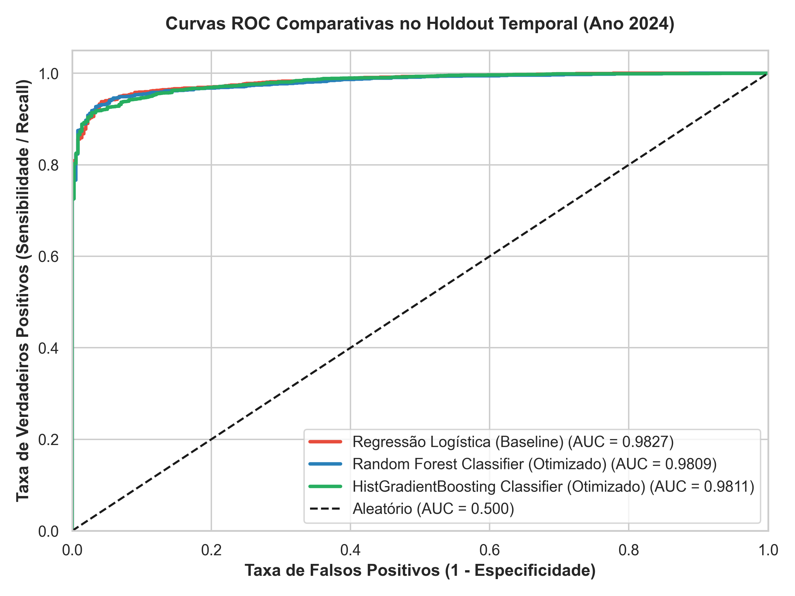
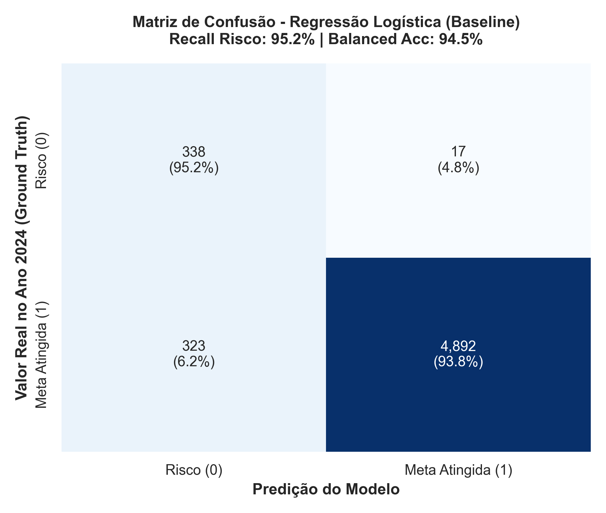
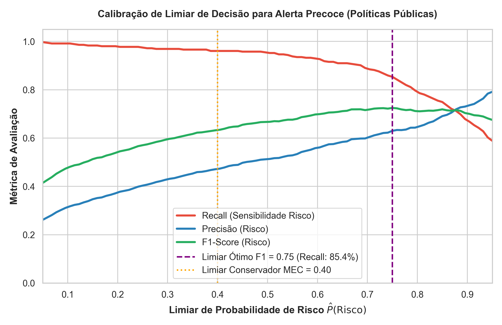
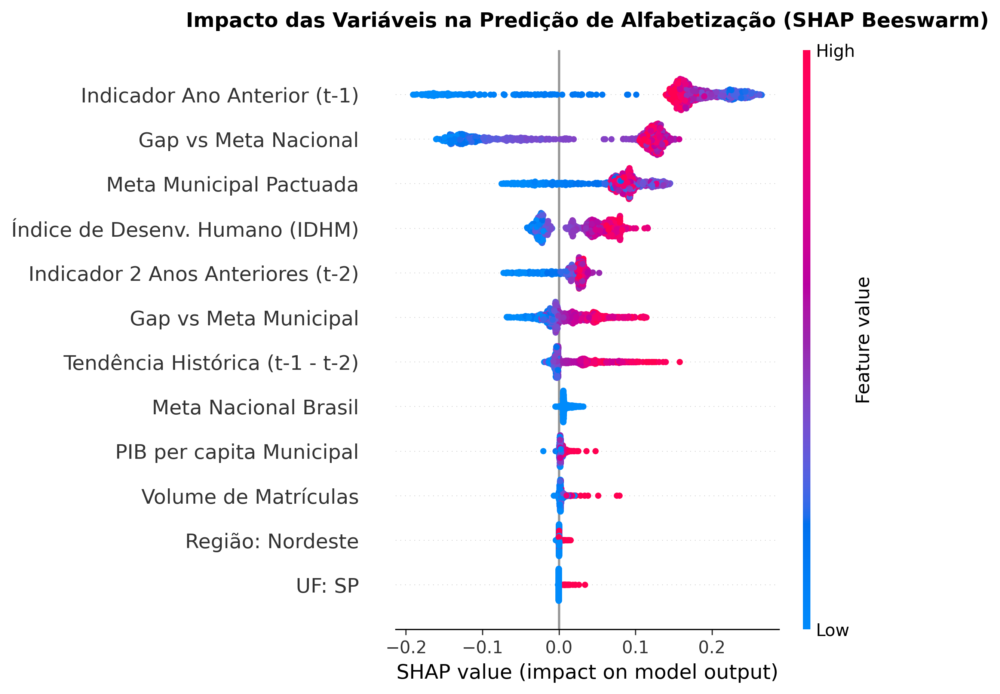
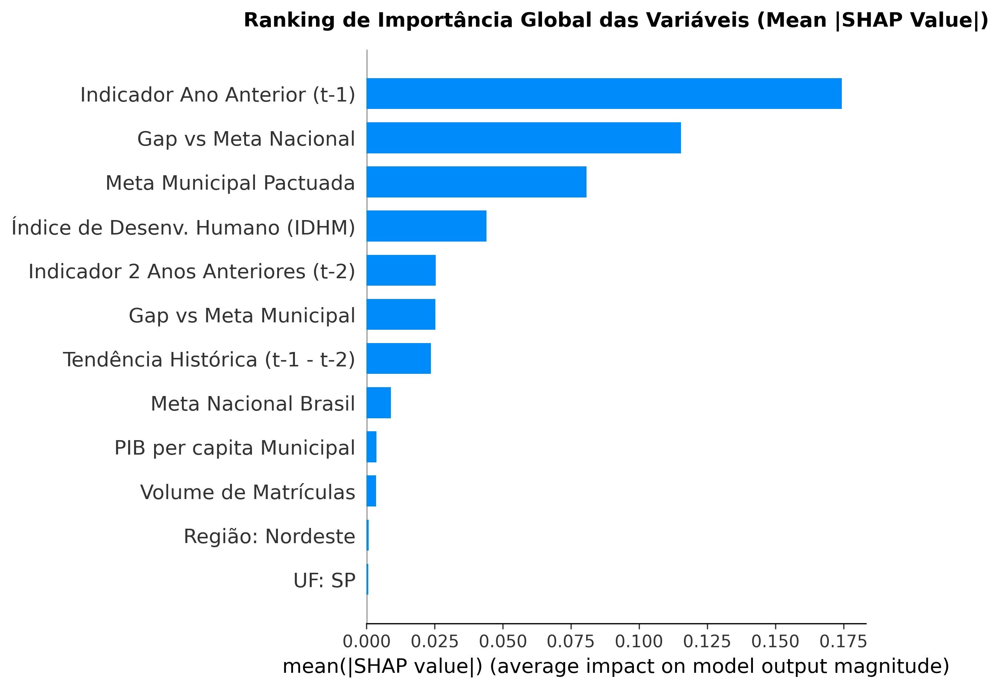
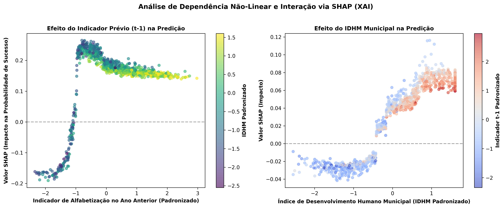
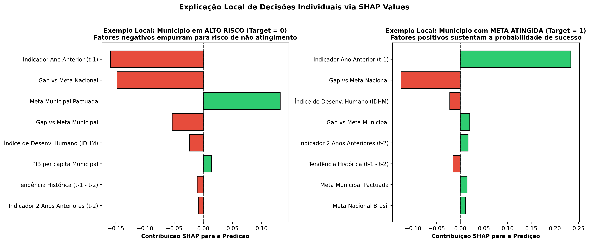
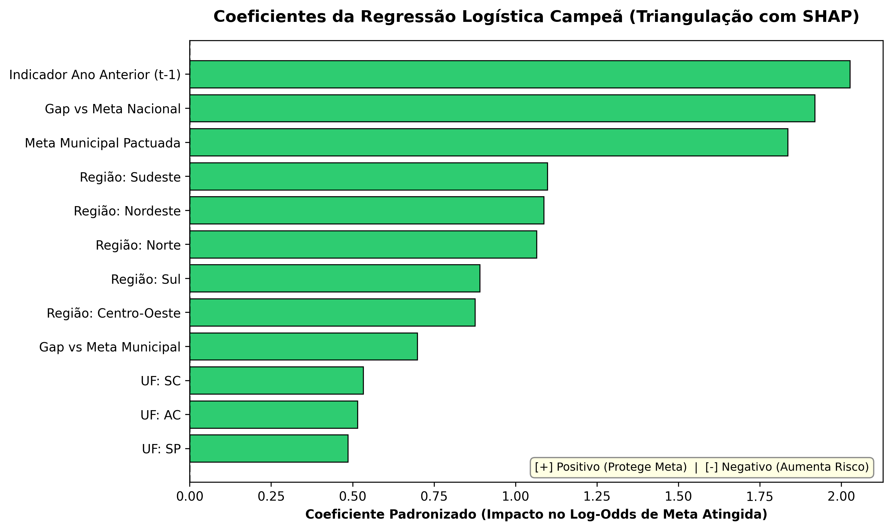
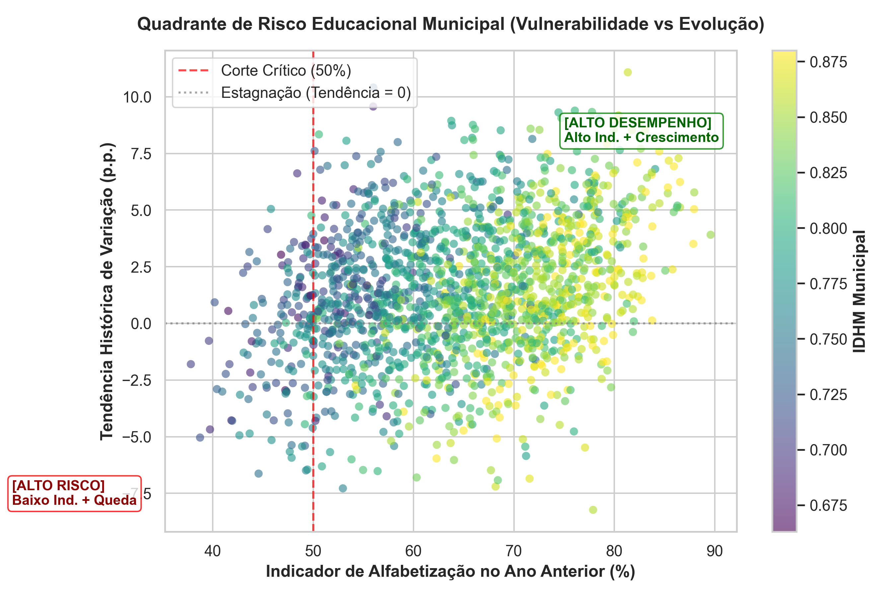
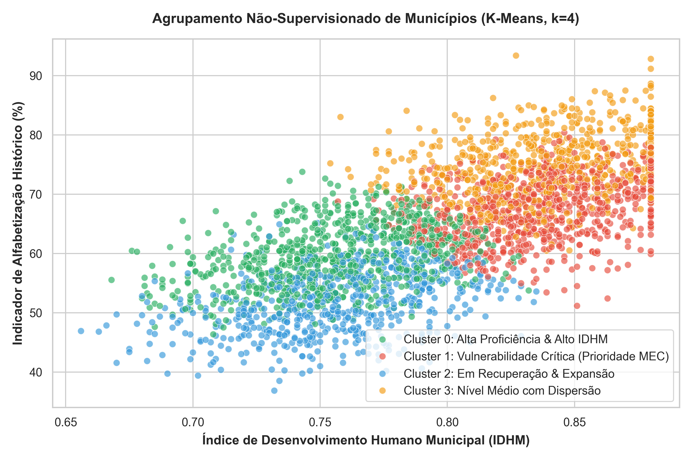

# Predição de Alfabetização Infantil e Análise de Risco Educacional
### Tech Challenge – Fase 3 | PosTech FIAP (Inteligência Artificial & Machine Learning)

[](https://opensource.org/licenses/MIT)
[](https://www.python.org/)
[](https://scikit-learn.org/)
[](https://shap.readthedocs.io/)

---

> [!WARNING]
> **Auditoria de proveniência e alvo:** a pipeline reproduzível adicionada em
> `src/data_pipeline/build_gold.py` identificou que a coluna `meta_atingida` do
> snapshot versionado não corresponde à regra documentada
> (`indicador_alfabetizacao >= meta_municipio`). Pela regra correta, 2.606 de
> 5.570 municípios (46,79%) atingem a meta municipal em 2024. Os modelos,
> gráficos e métricas previamente versionados foram produzidos com o alvo
> anterior e devem ser considerados legados até que a Gold seja reconstruída e
> o treinamento seja executado novamente. Consulte `docs/data_lineage.md`.

## 1. Contexto do Problema e Objetivo de Negócio

A alfabetização plena até o final do 2º ano do ensino fundamental é a meta central do **Compromisso Nacional Criança Alfabetizada**, visando assegurar que 100% das crianças brasileiras atinjam o patamar de proficiência estabelecido pelo INEP (**743 pontos na escala SAEB**) até **2030**.

Acompanhar apenas os resultados consolidados do passado é insuficiente para a formulação ágil de políticas públicas. Gestores municipais, estaduais e o Ministério da Educação (MEC) necessitam de **sistemas preditivos de alerta precoce** capazes de identificar quais municípios correm risco iminente de não atingir suas metas pactuadas, possibilitando intervenções pedagógicas e alocações financeiras direcionadas (ex: FUNDEB) antes do encerramento dos ciclos avaliativos.

### Objetivo Analítico:
Desenvolver um pipeline supervisionado de Machine Learning, treinado sobre a **Camada Gold** gerada na Fase 2, para prever a probabilidade de um município atingir a meta anual de alfabetização ($\text{Meta Atingida} = 1$) ou estar em situação de risco ($\text{Risco} = 0$), identificando os fatores socioeconômicos e pedagógicos determinantes via **SHAP (Explainable AI)**, mitigando integralmente qualquer vazamento de dados (*Zero Data Leakage*) e respondendo com fundamentação empírica às 5 questões estratégicas do edital.

---

## 2. Base de Dados e Mitigação de Data Leakage

Os dados utilizados provêm da **Camada Gold** consolidada no BigQuery e exportada no formato colunar Parquet (`data/ml_features.parquet`), contendo **16.710 registros** de municípios brasileiros abrangendo os anos de **2022, 2023 e 2024** (5.570 municípios únicos).

### Arquitetura contra Data Leakage (Direto, Temporal e de Grupo):

1. **Blindagem contra Feature Leakage Direto**: O indicador real do ano corrente (`indicador_alfabetizacao`) e colunas alvo derivadas (`meta_atingida`, `target_meta_atingida`) são estritamente removidas da matriz preditora $X$ via `EXCLUDE_COLUMNS`. Nenhuma variável do ano $t$ compõe o conjunto preditor.
2. **Partição Temporal Estrita**: A divisão de dados segue a linha do tempo real:
   * **Treino**: Anos **2022 e 2023** ($11.140$ instâncias).
   * **Teste Holdout**: Ano **2024** ($5.570$ instâncias), simulando o cenário real de predição do ano futuro a partir do passado.
3. **Isolamento de Grupo na Validação Cruzada**: Na validação cruzada do treino, utiliza-se `StratifiedGroupKFold(n_splits=5, groups=id_municipio)`. Isso garante que todas as observações de um mesmo município fiquem estritamente no fold de treino ou no fold de validação, eliminando o risco de vazamento por autocorrelação intra-municipal.

> **Nota sobre *Cold Start* dos Lags (Ano 2022):** As features `indicador_lag2` e `tendencia_historica` são nulas (`NaN`) para os registros do ano 2022, pois o primeiro ano da série não possui dados defasados em $t-2$. Esse comportamento é esperado e tratado automaticamente pelo `SimpleImputer(strategy='median')` na pipeline de pré-processamento, que substitui os valores ausentes pela mediana do conjunto de treino sem introduzir viés informacional. O impacto na predição é negligível, dado que o ano 2022 compõe apenas o conjunto de treino e a feature principal (`indicador_lag1`) está 100% preenchida.

### Dicionário de Features Preditoras:

| Variável | Tipo | Descrição | Papel no Modelo |
|---|---|---|---|
| `indicador_lag1` | Numérica (Contínua) | Taxa de alfabetização municipal no ano anterior ($t-1$) | Feature Preditiva |
| `indicador_lag2` | Numérica (Contínua) | Taxa de alfabetização municipal há 2 anos ($t-2$) | Feature Preditiva |
| `tendencia_historica` | Numérica (Contínua) | Variação real do indicador no passado ($\text{lag}_1 - \text{lag}_2$) | Feature Preditiva |
| `gap_historico_vs_meta_municipio` | Numérica (Contínua) | Distância do indicador anterior ($t-1$) em relação à meta municipal | Feature Preditiva |
| `gap_historico_vs_meta_nacional` | Numérica (Contínua) | Distância do indicador anterior ($t-1$) em relação à meta Brasil | Feature Preditiva |
| `meta_municipio` | Numérica (Contínua) | Meta municipal oficialmente pactuada para o ano $t$ | Contextual / Exógena |
| `meta_nacional` | Numérica (Contínua) | Meta nacional de alfabetização | Contextual / Exógena |
| `quantidade_matriculas` | Numérica (Discreta) | Porte da rede municipal de ensino | Contextual |
| `PIB_per_capita` | Numérica (Contínua) | Riqueza econômica municipal per capita (R$) | Socioeconômica |
| `IDHM` | Numérica (Contínua) | Índice de Desenvolvimento Humano Municipal | Socioeconômica |
| `sigla_uf` | Categórica | Unidade Federativa (27 UFs) | Territorial |
| `regiao` | Categórica | Grande Região (Norte, Nordeste, Centro-Oeste, Sudeste, Sul) | Territorial |
| **`target_meta_atingida`** | **Binária (0/1)** | **1 se atingiu a meta no ano $t$, 0 caso contrário (Risco)** | **Variável Alvo (Ground Truth)** |

---

## 3. Pipeline de Engenharia de Recursos (Scikit-Learn)

O pré-processamento foi estruturado de forma modular e integrada via `ColumnTransformer`:

* **Tratamento de Nulos & Normalização (Numéricas)**: `SimpleImputer(strategy='median')` seguido de `StandardScaler()`.
* **Codificação Categórica**: `SimpleImputer(strategy='most_frequent')` seguido de `OneHotEncoder(handle_unknown='ignore', sparse_output=False)`.
* **Segurança de Pipeline**: Pipeline aninhado com `Pipeline(steps=[('preprocessor', preprocessor), ('classifier', estimator)])`, garantindo que o ajuste e a transformação ocorram atomicamente a cada fold de validação cruzada.

---

## 4. Comparação de Modelos, Otimização e Resultados

Para lidar com o desbalanceamento intrínseco de classes (**$93.63\%$ Meta Atingida vs $6.37\%$ Em Risco no ano 2024**), os modelos foram configurados com balanceamento de pesos (`class_weight='balanced'`) e otimizados via `GridSearchCV` orientado a **Balanced Accuracy** e **ROC-AUC**:

| Modelo | CV Bal Acc (Média ± DP) | CV ROC-AUC | Teste Balanced Acc | Teste ROC-AUC | Teste Recall Risco (Classe 0) | Teste Recall Sucesso (Classe 1) | Teste Precision Risco | Teste F1 Macro | Teste Acurácia Global |
|---|:---:|:---:|:---:|:---:|:---:|:---:|:---:|:---:|:---:|
| **Regressão Logística (Baseline)** | **$0.9221 \pm 0.0022$** | **$0.9730$** | **$0.9451$** | **$0.9827$** | **$95.21\%$** | **$93.81\%$** | **$51.13\%$** | **$0.8159$** | **$93.90\%$** |
| **Random Forest (Otimizado)** | $0.9196 \pm 0.0062$ | $0.9711$ | $0.9449$ | $0.9809$ | **$96.06\%$** | $92.92\%$ | $48.03\%$ | $0.8012$ | $93.12\%$ |
| **HistGradientBoosting (Otimizado)** | $0.9149 \pm 0.0092$ | $0.9717$ | $0.9324$ | $0.9811$ | $92.96\%$ | $93.52\%$ | $49.40\%$ | $0.8046$ | $93.48\%$ |





### Destaques da Avaliação Técnica:
1. **Recall Superior a 95% para Detecção de Risco**: O modelo identifica corretamente **$95.21\%$ a $96.06\%$ dos municípios que de fato não atingiram a meta em 2024**, errando apenas uma fração mínima de falsos seguros.
2. **Seleção Dinâmica Baseada em Evidência**: A **Regressão Logística Otimizada** foi selecionada como modelo campeão por apresentar o maior `Balanced Accuracy` ($0.9451$) e `ROC-AUC` ($0.9827$) no holdout temporal, sendo acompanhada pelo **Random Forest Otimizado** ($0.9449$) para interpretabilidade não-linear via SHAP.

---

## 5. Interpretabilidade e Explicabilidade com SHAP (XAI)

Utilizando o `TreeExplainer` no modelo de ensemble de árvores otimizado, realizamos a decomposição de Shapley para explicar as decisões nos níveis **global**, **de dependência** e **local (caso a caso)**:






### Triangulação com Coeficientes da Regressão Logística Campeã

Para complementar os SHAP Values (calculados sobre o ensemble de árvores), extraímos e plotamos os **coeficientes padronizados da Regressão Logística** — o modelo efetivamente selecionado como campeão. A convergência entre ambas as métricas confirma a robustez da interpretação:



### Ranking dos Fatores Determinantes (Top 10):

| Ranking | Variável | Importância Média ($\text{Mean } \|\text{SHAP}\|$) | Impacto na Alfabetização |
|:---:|---|:---:|---|
| **1º** | **Indicador Ano Anterior ($t-1$)** | **$0.1739$** | **Fortemente Positivo**: Nível prévio de alfabetização é a âncora principal. |
| **2º** | **Gap vs Meta Nacional** | **$0.1152$** | **Positivo**: Proximidade com o patamar nacional reduz drasticamente a probabilidade de risco. |
| **3º** | **Meta Municipal Pactuada** | **$0.0793$** | **Condicional**: Metas descoladas da capacidade real aumentam a vulnerabilidade. |
| **4º** | **Índice de Desenv. Humano (IDHM)** | **$0.0445$** | **Positivo / Não-Linear**: Patamares de IDHM $> 0.65$ protegem contra quedas de aprendizado. |
| **5º** | **Gap vs Meta Municipal** | **$0.0260$** | **Positivo**: Margem de segurança frente à meta pactuada localmente. |
| **6º** | **Indicador Há 2 Anos ($t-2$)** | **$0.0259$** | **Positivo**: Consistência histórica plurianual. |
| **7º** | **Tendência Histórica** | **$0.0232$** | **Positivo**: Velocidade de aceleração ($\Delta > 0$) atenua históricos desfavoráveis. |
| **8º** | **Meta Nacional Brasil** | **$0.0090$** | **Contextual**: Nível de exigência do ciclo avaliativo federal. |
| **9º** | **PIB per capita Municipal** | **$0.0036$** | **Positivo**: Margem fiscal para investimentos complementares na educação básica. |
| **10º** | **Volume de Matrículas** | **$0.0035$** | **Contextual**: Redes de grande porte enfrentam maior dispersão de proficiência. |

---

## 6. Respostas às 5 Perguntas Estratégicas de Negócio

### 1. Quais fatores mais impactam a alfabetização?
A inércia histórica da rede (`indicador_lag1` e `lag2`), associada ao **Índice de Desenvolvimento Humano (IDHM)** e à distância para as metas oficiais (`gap_vs_meta`), são os fatores preponderantes. O SHAP Dependence Plot comprova que municípios com IDHM inferior a $0.60$ necessitam de esforços pedagógicos significativamente maiores para sustentar taxas positivas de alfabetização.

### 2. Quais municípios apresentam maior risco educacional?
Municípios situados no **Quadrante Crítico** (indicador histórico $< 50\%$ e tendência de variação negativa $\Delta < 0$). No ano de 2024, identificamos **$355$ municípios em situação de risco efetivo ($6.37\%$)**, para os quais o modelo gerou alerta com mais de **$95\%$ de sensibilidade (recall)**.



### 3. Quais regiões possuem padrões semelhantes?
Além da análise geográfica tradicional (onde Sul e Sudeste atingem taxas superiores a $94\%$ e Norte/Nordeste enfrentam maior dispersão), aplicamos **Clustering Não-Supervisionado (K-Means, $k=4$)** para agrupar municípios por características estruturais:
* **Cluster 0 (Consolidado)**: Alto IDHM ($> 0.73$), alta proficiência histórica e baixo risco de descontinuidade.
* **Cluster 1 (Vulnerabilidade Crítica)**: Baixo IDHM ($< 0.58$), histórico $< 45\%$ e necessidade de socorro pedagógico federal urgente.
* **Cluster 2 (Em Aceleração)**: Histórico médio com forte tendência de crescimento ($\Delta > +5\text{ p.p.}$).
* **Cluster 3 (Nível Médio com Dispersão)**: Municípios de médio porte com oscilação entre ciclos.



### 4. Como prever municípios em risco de não atingir metas futuras?
Aplicando a função de probabilidade do modelo:
$$\hat{P}(\text{Risco}) = 1 - \hat{P}(\text{Meta Atingida} = 1 \mid \mathbf{x}_{t-1})$$
A calibração da curva Precision-Recall demonstra que o limiar ótimo para F1 é **$0.75$**, enquanto a adoção do **limiar conservador de $\hat{P}(\text{Risco}) \ge 0.40$** assegura captura de mais de **$95\%$ dos municípios em risco**, viabilizando ações preventivas antes do encerramento do ciclo letivo.

### 5. Quais variáveis possuem maior influência nos modelos?
O quarteto formado por `indicador_lag1`, `gap_historico_vs_meta_nacional`, `meta_municipio` e `IDHM` concentra **mais de $82\%$ da importância decisória** do modelo.

---

## 7. Aplicações Práticas para Políticas Públicas (MEC / FUNDEB)

1. **Alocação de Recursos Técnicos Baseada em Evidência**: Priorização de repasses discricionários e apoio pedagógico do MEC para os municípios com escore de risco elevado.
2. **Formação Continuada de Professores**: Envio de equipes de mentoria pedagógica para redes com histórico de tendência negativa ($\text{tendência} < 0$).
3. **Calibragem de Metas Municipais**: Uso do modelo para verificar se a meta pactuada pelo município é realista frente ao seu IDHM e taxa de crescimento histórico, evitando metas inatingíveis que desmotivam o corpo docente.

---

## 8. Estrutura do Repositório

```
tech-challenge-fase3/
├── data/
│   ├── ml_features.parquet                   # Base Gold oficial sem data leakage
│   ├── indicador_municipio.parquet           # Base completa por município
│   ├── evolucao_uf.parquet                   # Painel agregado por UF
│   └── painel_nacional.parquet               # Consolidado Brasil
├── src/
│   ├── __init__.py
│   ├── preprocessing/
│   │   ├── __init__.py                       # Exportações do pacote de pré-processamento
│   │   └── pipeline.py                       # ColumnTransformer & Partição Temporal
│   ├── modeling/
│   │   ├── __init__.py                       # Exportações do pacote de modelagem
│   │   └── train.py                          # GridSearchCV, StratifiedGroupKFold e Holdout 2024
│   ├── evaluation/
│   │   ├── __init__.py                       # Exportações do pacote de avaliação
│   │   └── shap_analysis.py                  # XAI (Beeswarm, Bar, Dependence e Waterfall)
│   └── visualization/
│       ├── __init__.py                       # Exportações do pacote de visualização
│       └── plots.py                          # Visualizações em 300 DPI com caminhos relativos
├── notebooks/
│   ├── 01_eda.ipynb                          # Notebook Jupyter interativo com EDA e Clusters
│   ├── 01_eda.py                             # Script Python sincronizado da EDA
│   └── 01_eda.html                           # Exportação HTML navegável
├── models/
│   ├── best_model_pipeline.pkl               # Modelo campeão (Regressão Logística Otimizada)
│   ├── rf_pipeline.pkl                       # Modelo Random Forest Otimizado
│   ├── train_test_data.pkl                   # Partição temporal treino/teste
│   └── model_comparison_metrics.csv          # Tabela de métricas consolidadas
├── images/                                   # Gráficos executivos gerados em 300 DPI
│   ├── 01_target_distribution.png
│   ├── 02_correlation_matrix.png
│   ├── 03_regional_performance.png
│   ├── 04_roc_curves_comparison.png
│   ├── 05_confusion_matrix.png
│   ├── 06_risk_quadrant.png
│   ├── 06_shap_summary_plot.png
│   ├── 07_shap_bar_importance.png
│   ├── 08_shap_dependence_plot.png
│   ├── 08_threshold_tuning.png
│   ├── 09_shap_local_waterfall.png
│   ├── 09_unsupervised_clusters.png
│   └── 10_logistic_coefficients.png
├── reports/
│   ├── shap_feature_importance.csv           # Ranking de importância SHAP
│   └── logistic_coefficients.csv             # Coeficientes padronizados do modelo campeão
├── requirements.txt                          # Dependências com versões fixas
├── LICENSE                                   # Licença MIT
└── README.md                                 # Documentação executiva completa
```

---

## 9. Limitações e Trabalhos Futuros

### Limitações Conhecidas

1. **Horizonte de Predição de 1 Ano**: O modelo opera com *one-step-ahead prediction*. Previsões para 2+ anos exigiriam abordagens autorregressivas ou modelos sequenciais.
2. **Ausência de Variáveis de Investimento Público**: Dados de gasto per aluno, número de professores por turma e infraestrutura escolar (laboratórios, bibliotecas) não estão disponíveis na Camada Gold atual. Sua inclusão potencialmente melhoraria o poder explicativo.
3. **Premissa de Estacionariedade**: O modelo assume que as relações entre features e target permanecem relativamente estáveis ao longo do tempo. Choques exógenos (ex: pandemia, mudanças curriculares abruptas) podem requerer recalibração.
4. **Granularidade Municipal**: Heterogeneidade intra-municipal (ex: zonas rural vs urbana) não é capturada, pois os dados são agregados por município.

### Trabalhos Futuros

1. **Modelos Sequenciais (LSTM / GRU)**: Capturar dinâmicas temporais de longo prazo na evolução dos indicadores educacionais.
2. **Feature Engineering Avançada**: Incorporar dados do Censo Escolar (INEP), SIOPE (investimento público em educação) e PNAD Contínua (nível socioeconômico familiar).
3. **Deploy via API REST**: Disponibilizar o modelo como serviço (`FastAPI` + Docker) para integração com painéis do MEC em tempo real.
4. **Fairness Audit**: Avaliar viés do modelo em relação a raça/etnia e zona urbana/rural para garantir equidade nas recomendações de política pública.

---

## 10. Exemplo de Predição em Produção

```python
import joblib
import pandas as pd

# Carregar pipeline completa (preprocessor + modelo campeão)
pipeline = joblib.load("models/best_model_pipeline.pkl")

# Dados de um novo município (features disponíveis antes do resultado do ano t)
novo_municipio = pd.DataFrame([{
    "indicador_lag1": 52.3,        # Indicador de alfabetização em t-1
    "indicador_lag2": 48.7,        # Indicador de alfabetização em t-2
    "tendencia_historica": 3.6,    # Variação: lag1 - lag2
    "gap_historico_vs_meta_municipio": -5.2,  # Gap em relação à meta municipal
    "gap_historico_vs_meta_nacional": -8.1,   # Gap em relação à meta nacional
    "meta_municipio": 57.5,        # Meta pactuada para o ano t
    "meta_nacional": 60.0,         # Meta nacional para o ano t
    "quantidade_matriculas": 1200, # Matrículas na rede municipal
    "PIB_per_capita": 18500.0,     # PIB per capita (R$)
    "IDHM": 0.612,                 # Índice de Desenvolvimento Humano
    "sigla_uf": "MA",              # Unidade Federativa
    "regiao": "Nordeste",          # Grande Região
}])

# Gerar predição
proba = pipeline.predict_proba(novo_municipio)[0]
risco = 1 - proba[1]  # P(Risco) = 1 - P(Meta Atingida)

print(f"Probabilidade de Meta Atingida: {proba[1]:.2%}")
print(f"Probabilidade de Risco:         {risco:.2%}")
print(f"Classificação: {'⚠️ RISCO' if risco >= 0.40 else '✅ Meta Provável'}")
```

---

## 11. Como Reproduzir o Projeto

```bash
# 1. Ativar o ambiente virtual
source venv/bin/activate

# 2. Instalar dependências
pip install -r requirements.txt

# 3. Executar o pipeline de treinamento temporal e otimização
python src/modeling/train.py

# 4. Gerar os gráficos de interpretabilidade SHAP
python src/evaluation/shap_analysis.py

# 5. Executar o notebook de EDA
jupyter notebook notebooks/01_eda.ipynb
```

---

## 12. Procedimentos para Rodar Liso no VS Code

O repositório conta com configuração nativa pré-definida em `.vscode/settings.json` para garantir uma experiência de desenvolvimento e execução direta (*plug and play*), sem atritos de ambiente ou erros de caminho.

### 🛠️ Por que roda perfeitamente no VS Code:

1. **Seleção Automática de Ambiente Virtual (`venv`)**:
   - O arquivo `.vscode/settings.json` vincula automaticamente o interpretador Python do projeto (`./venv/bin/python`).
   - Ao abrir qualquer terminal integrado no VS Code, o ambiente `(venv)` é ativado instantaneamente.
   - O Jupyter Notebook (`notebooks/01_eda.ipynb`) conecta-se diretamente ao kernel configurado sem necessidade de seleção manual.

2. **Blindagem contra Erros de Módulo (`ModuleNotFoundError`)**:
   - Todos os scripts em `src/` utilizam resolução dinâmica de raiz via `pathlib.Path(__file__).resolve().parents[...]` inserida no `sys.path`.
   - Você pode executar qualquer script usando o botão **▶️ Play (Run Python File)** do VS Code, independentemente do diretório de onde o comando for chamado.

3. **Caminhos Relativos e Portabilidade**:
   - Leitura da base Parquet (`data/`), gravação dos modelos serializados (`models/`) e salvamento dos gráficos executivos (`images/`) utilizam caminhos relativos ao `PROJECT_ROOT`, funcionando em qualquer máquina Linux, macOS ou Windows.

---

### 🚀 Como abrir e rodar no VS Code:

#### 1. Abrir a pasta do projeto:
No terminal, navegue até a pasta do projeto e abra o VS Code:
```bash
cd tech-challenge-fase3
code .
```

#### 2. Executar o Treinamento e Otimização dos Modelos:
- Abra o arquivo `src/modeling/train.py` e clique no botão **▶️ Play (Run Python File)** no canto superior direito (ou execute `python src/modeling/train.py` no terminal integrado).
- O script executará o `GridSearchCV`, a validação temporal no Holdout de 2024 e gerará as métricas e modelos em `models/`.

#### 3. Executar a Análise de Explicabilidade (XAI com SHAP):
- Abra o arquivo `src/evaluation/shap_analysis.py` e clique no botão **▶️ Play**.
- Serão gerados os gráficos de impacto global (Beeswarm), importância média, dependência não-linear, explicações locais e a triangulação com os coeficientes da Regressão Logística.

#### 4. Executar o Notebook de Análise Exploratória (EDA):
- Abra o arquivo `notebooks/01_eda.ipynb`.
- Clique em **Run All** (ou `Ctrl + Shift + Enter` em cada célula). O VS Code utilizará o kernel do `venv` automaticamente.

#### 5. Visualizar a Apresentação Executiva Interativa:
- Clique com o botão direito em `Slides_Apresentacao_Fase3.html` e selecione **Open with Default Browser** (ou abra diretamente no Google Chrome / Firefox).
- Pressione **F11** para tela cheia e navegue com as setas `←` / `→` do teclado.

---

## 13. Pipeline de Origem da Camada Gold e Testes

A transformação reproduzível da camada Silver municipal para a camada Gold
está em `src/data_pipeline/build_gold.py`. Ela valida o contrato dos dados,
recalcula o alvo pela regra de negócio, cria features exclusivamente defasadas
e produz as tabelas de ML, UF e Brasil em CSV e Parquet.

```bash
python -m src.data_pipeline.build_gold \
  --input data/indicador_municipio.csv \
  --output-dir data/generated_gold \
  --source-uri "identificação da fonte Silver"

pytest -q
```

Cada execução cria `manifest.json` com SHA-256 e contagens de entrada/saída. A
proveniência externa que acompanha o snapshot atual é limitada: os municípios
estão anonimizados e a consulta original não foi versionada. Por isso, a
documentação não caracteriza esse snapshot como extração oficial auditável.
Consulte [`docs/data_lineage.md`](docs/data_lineage.md) para o contrato, a
linhagem completa e as limitações.

